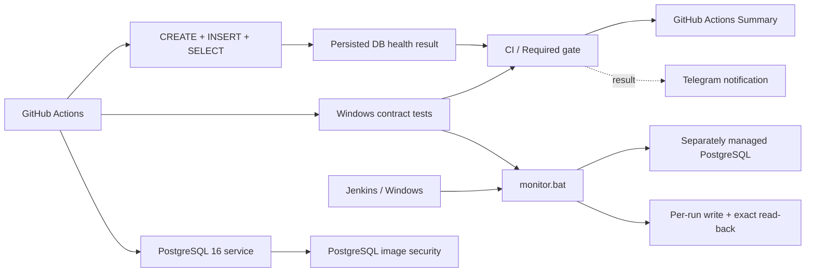

# Гибридный QA-мониторинг PostgreSQL

[](https://github.com/TokhirjonYuldoshev/qa-docker-monitor/actions/workflows/main.yml)
[](https://github.com/TokhirjonYuldoshev/qa-docker-monitor/actions/workflows/container-security.yml)

Портфолио-проект по инженерии качества и наблюдаемому мониторингу PostgreSQL. Главный health-сигнал строится не на `ping` или открытом порте, а на **реальной записи в БД с точным read-back маркера текущего запуска**. GitHub Actions проверяет cloud/synthetic path, Windows contract-тесты защищают поведение `monitor.bat`, а Telegram используется только как вспомогательный канал доставки результата.

## Ключевые сигналы

| Сигнал | Что подтверждает | Источник истины | Блокирующий |
| --- | --- | --- | --- |
| `PostgreSQL write/read health check` | readiness + `CREATE` + `INSERT` + точный `SELECT` | persisted PostgreSQL state | Да |
| `Windows monitor contract` | exit-code и orchestration semantics `monitor.bat` | contract harness | Да для PR/push/manual |
| `CI / Required gate` | агрегирует обязательные сигналы | upstream jobs | Да |
| `Security / PostgreSQL image` | CRITICAL scan + reachability evidence + SBOM | security workflow | Да |
| `Telegram Notification` | доставку результата | Telegram API | Нет |

## Что демонстрирует проект

- PostgreSQL 16 service container и плановые synthetic health checks;
- реальный SQL `CREATE / INSERT / SELECT` вместо поверхностной проверки доступности порта;
- уникальный per-run marker, исключающий ложный read-back чужой записи;
- pre-merge validation monitoring logic через Pull Request;
- Windows/Jenkins contract-тесты с изолированными command doubles;
- независимый security workflow для PostgreSQL image: Trivy, reachability proof и CycloneDX SBOM;
- стабильный `CI / Required gate`;
- структурированный GitHub Actions Summary и сохраняемые evidence artifacts;
- Telegram-уведомления в едином формате портфолио;
- Dependabot, `SECURITY.md`, `CONTRIBUTING.md`, `CODEOWNERS`, PR template и incident Issue Form;
- формализованный разбор инцидентов без rerun-until-green и masking retries.

## Архитектура



## Основной CI-процесс

Файл: `.github/workflows/main.yml`.

Триггеры:

- **Pull Request** — SQL health + Windows contract; Telegram намеренно не отправляется;
- **push в `main`** — полный validation path + итоговое Telegram-уведомление;
- **`workflow_dispatch`** — ручной полный запуск;
- **schedule в 09:00 и 21:00 UTC** — synthetic PostgreSQL health check без лишнего расхода Windows runner.

Для каждого запуска создаётся уникальный marker из `GITHUB_RUN_ID` и `GITHUB_RUN_ATTEMPT`:

```sql
CREATE TABLE IF NOT EXISTS robot_log (...);
INSERT INTO robot_log (status) VALUES ('<unique run marker>');
SELECT count(*) FROM robot_log WHERE status = '<unique run marker>';
```

Health считается успешным только если SQL-команды завершились без ошибки и read-back вернул **ровно одну** запись текущего запуска. Успешный старт процесса PostgreSQL или открытый порт сами по себе не считаются доказательством здоровья БД.

## Контракт Windows/Jenkins

Job `Windows monitor contract` запускает `tests/monitor-contract.ps1` против production-скрипта `monitor.bat` с изолированными doubles для `docker.cmd` и `curl.cmd`.

| Сценарий | Ожидаемый exit code |
| --- | ---: |
| DB write/read успешен, Telegram выключен | `0` |
| DB write/read успешен, Telegram transport упал | `0` |
| Read-back command завершился ошибкой | `1` |
| Read-back не совпал с marker текущего запуска | `1` |
| DB command упала и Telegram тоже упал | `1` |

Контракт защищает принцип: **database health владеет exit code, Telegram — нет**. Подробности и локальный запуск: [`tests/README.md`](tests/README.md).

## Агрегирующий quality gate

`CI / Required gate` собирает результаты независимых jobs. Для PR, push и manual run нужны успешные PostgreSQL health и Windows contract. Для scheduled run Windows contract намеренно `skipped`, а gate оценивает только synthetic PostgreSQL health.

GitHub Actions Summary показывает общий итог, trigger, branch, commit и прямую ссылку на run. Aggregate gate не заменяет evidence исходного job: при ошибке сначала анализируется владелец сигнала.

## Безопасность PostgreSQL image

`.github/workflows/container-security.yml` независимо проверяет image, используемый CI:

- Trivy scan на fixable `CRITICAL` vulnerabilities;
- извлечение точного `gosu` binary;
- pinned binary-mode `govulncheck` для reachability proof известного compiler-level finding;
- CycloneDX SBOM;
- сохранение scan/reachability/SBOM evidence;
- блокировка новых или неподтверждённых fixable CRITICAL findings.

Подробности правил: [`SECURITY.md`](SECURITY.md).

## Telegram-уведомления

Telegram — **вспомогательный observability transport**, а не источник истины для DB health. Ошибка Telegram не делает исправную БД красной и не может скрыть реальный PostgreSQL failure.

После push в `main`, manual или scheduled run сообщение оформляется в едином стиле портфолио:

- заголовок `QA Database Health Monitor` и краткое описание;
- крупный итоговый статус: `МОНИТОРИНГ ИСПРАВЕН`, `МОНИТОРИНГ ТРЕБУЕТ ВНИМАНИЯ`, `ЗАПУСК ОТМЕНЁН` или неполный результат;
- репозиторий, ветка, событие и автор;
- отдельный блок результатов PostgreSQL health, Windows contract и `CI / Required gate`;
- заметная ссылка на GitHub Actions run.

Transport использует ограниченные timeout, `curl --retry 2 --retry-all-errors` и подтверждает одновременно HTTP `200` и Telegram JSON `.ok == true`.

Основные repository secrets:

```text
TELEGRAM_BOT_TOKEN
TELEGRAM_CHAT_ID
```

Для обратной совместимости также поддерживаются `TG_TOKEN` и `TG_CHAT_ID`. Для отдельной диагностики есть manual-only `.github/workflows/telegram-test.yml` (`getMe` → `getChat` → `sendMessage`).

## Границы мониторинга

Плановый GitHub Actions path — **synthetic canary на временном PostgreSQL service container**. Зелёный run подтверждает корректность monitoring contract в GitHub-hosted runner, но не доказывает доступность чужой production/long-lived БД.

`monitor.bat` представляет отдельный Windows/Jenkins-compatible path для самостоятельно управляемого PostgreSQL container. Эти границы зафиксированы в [`docs/monitoring-boundary.md`](docs/monitoring-boundary.md).

## Локальный / Jenkins-compatible monitor

`monitor.bat` формирует `EXPECTED_STATUS` из `BUILD_NUMBER` и `RUN_TOKEN`, записывает его в `robot_log`, затем читает **именно этот marker** и сравнивает с ожидаемым значением.

| Переменная | Обязательна | Поведение |
| --- | --- | --- |
| `DB_CONTAINER` | Нет | по умолчанию `dev-postgres-db` |
| `BUILD_NUMBER` | Нет | вне Jenkins используется `manual` |
| `RUN_TOKEN` | Нет | генерируется token текущего запуска |
| `TOKEN` | Нет для DB health | вместе с `CHAT_ID` включает Telegram |
| `CHAT_ID` | Нет для DB health | вместе с `TOKEN` включает Telegram |

Telegram delivery и retention cleanup выполняются best-effort и не имеют права переписать database-health exit code.

## Правила обработки ошибок

- readiness/setup/SQL/read-back failure делает соответствующий health path красным;
- persisted PostgreSQL write/read result остаётся главным health signal;
- per-run marker защищает от ложноположительного результата из-за параллельного writer;
- Telegram failure не создаёт ложный DB failure и не скрывает настоящую ошибку БД;
- PR validation не отправляет operational Telegram alerts;
- `CI / Required gate` не может быть зелёным при падении обязательного upstream signal;
- Windows contract защищает эти правила от регрессии;
- incident process запрещает rerun-until-green, произвольные sleeps и retries для маскировки причины.

## Разбор инцидентов

[`docs/incident-runbook.md`](docs/incident-runbook.md) задаёт порядок triage по владельцу сигнала, severity model и exit criteria. `.github/ISSUE_TEMPLATE/monitoring_incident.yml` превращает эти правила в структурированную форму инцидента.

Для предполагаемого runner/platform incident допускается максимум **один targeted diagnostic rerun** только после конкретного evidence восстановления внешнего условия. Исходный failed run сохраняется.

## Обновление зависимостей

`.github/dependabot.yml` проверяет GitHub Actions раз в неделю по часовому поясу `Europe/Minsk`. Minor/patch updates группируются, major updates остаются отдельными инженерными изменениями. Dependency PR проходит те же обязательные проверки до merge.

## Документация

- [`docs/README.md`](docs/README.md) — карта документации;
- [`CONTRIBUTING.md`](CONTRIBUTING.md) — правила изменений и evidence перед merge;
- [`SECURITY.md`](SECURITY.md) — работа с секретами и security findings;
- [`docs/monitoring-boundary.md`](docs/monitoring-boundary.md) — границы synthetic и separately managed paths;
- [`docs/incident-runbook.md`](docs/incident-runbook.md) — triage и incident response;
- [`tests/README.md`](tests/README.md) — Windows contract harness.

## Структура репозитория

```text
qa-docker-monitor/
├── .github/
│   ├── CODEOWNERS
│   ├── dependabot.yml
│   ├── ISSUE_TEMPLATE/
│   │   ├── config.yml
│   │   └── monitoring_incident.yml
│   ├── pull_request_template.md
│   └── workflows/
│       ├── container-security.yml
│       ├── main.yml
│       └── telegram-test.yml
├── docs/
│   ├── README.md
│   ├── incident-runbook.md
│   └── monitoring-boundary.md
├── tests/
│   ├── README.md
│   └── monitor-contract.ps1
├── CONTRIBUTING.md
├── SECURITY.md
├── monitor.bat
└── README.md
```

## Почему это QA-проект

Цель — показать не просто «монитор, который иногда пингует БД», а проверяемый quality contract: конкретная запись должна быть принята, сохранена и считана обратно для текущего запуска; orchestration semantics защищены тестами; security и operational signals разделены; notification transport не подменяет health; incident response основан на evidence.

Такой подход демонстрирует QA Engineering для инфраструктуры и CI/CD без заявления, что synthetic check является production-monitoring чужой системы.

---

**Портфолио-проект Тохиржона Йулдошева**
