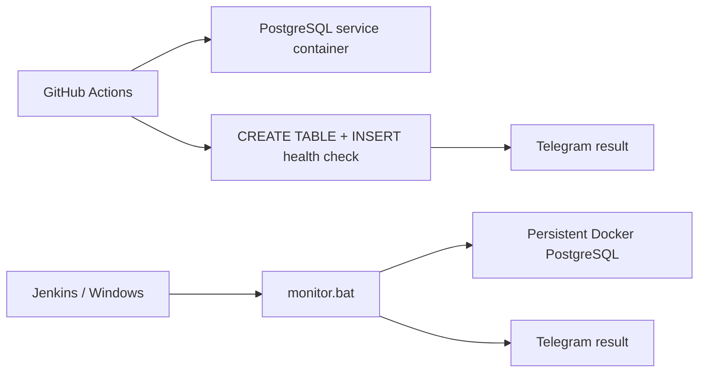

# Hybrid QA Monitoring System

Automated PostgreSQL health checks with **GitHub Actions**, **Docker**, **Jenkins-compatible Windows monitoring** and **Telegram alerts**.

## What this project demonstrates

- scheduled database health checks in GitHub Actions;
- PostgreSQL service container with readiness health check;
- SQL write validation instead of a superficial port-only check;
- manual and push-triggered cloud runs;
- Telegram notifications for success and failure;
- local Windows monitoring script intended for Jenkins execution;
- credentials passed through CI/Jenkins secret storage rather than committed to the repository.

## Architecture



## Cloud workflow

Workflow: `.github/workflows/main.yml`

Triggers:

- push to `main`;
- manual `workflow_dispatch`;
- schedule at **09:00 and 21:00 UTC** every day.

The GitHub runner starts a PostgreSQL service container, waits for its health check, installs the PostgreSQL client and performs a real SQL write operation:

```sql
CREATE TABLE IF NOT EXISTS robot_log (...);
INSERT INTO robot_log (status) VALUES ('GitHub Cloud Test - OK');
```

A successful or failed check is then reported to Telegram through repository secrets.

## Local / Jenkins-compatible monitor

`monitor.bat` checks a persistent Docker container named `dev-postgres-db` by executing an `INSERT` through `psql`. The script returns a non-zero exit code when the database check fails and sends the result to Telegram.

Expected environment variables are supplied by Jenkins or another runner:

```text
TOKEN
CHAT_ID
BUILD_NUMBER
```

No bot token or chat ID is stored in the repository.

## Tech stack

| Area | Technology |
| --- | --- |
| CI / scheduling | GitHub Actions |
| Local automation | Jenkins / Windows batch |
| Database | PostgreSQL |
| Containerization | Docker |
| Validation | SQL health check |
| Notifications | Telegram Bot API |

## Repository structure

```text
qa-docker-monitor/
├── .github/
│   └── workflows/
│       └── main.yml
├── monitor.bat
└── README.md
```

## Why this is a QA project

The goal is not only to keep a process alive. The monitor verifies an observable product dependency — database availability **and write capability** — and produces a repeatable CI signal with failure notification.

---

**Portfolio project by Tokhirjon Yuldoshev**
