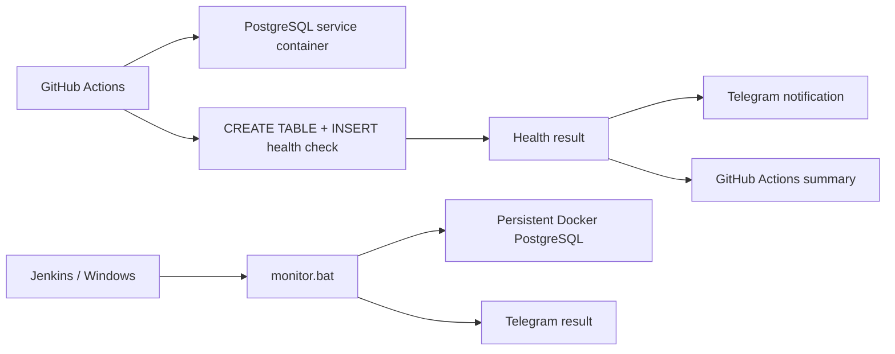

# Hybrid QA Monitoring System

[](https://github.com/TokhirjonYuldoshev/qa-docker-monitor/actions/workflows/main.yml)

Automated PostgreSQL health checks with **GitHub Actions**, **Docker**, **Jenkins-compatible Windows monitoring** and **Telegram alerts**.

## What this project demonstrates

- scheduled database health checks in GitHub Actions;
- pre-merge validation of monitoring changes on pull requests;
- PostgreSQL service container with readiness health check;
- SQL write validation instead of a superficial port-only check;
- explicit separation between the **health signal** and the **notification channel**;
- GitHub Actions run summary with the health-check outcome;
- local Windows monitoring script intended for Jenkins execution;
- credentials passed through CI/Jenkins secret storage rather than committed to the repository.

## Architecture



## Cloud workflow

Workflow: `.github/workflows/main.yml`

Triggers:

- pull requests — validates the health-check workflow before merge, with Telegram notifications intentionally skipped;
- push to `main` — runs the check and may send Telegram status;
- manual `workflow_dispatch` — runs the check on demand;
- schedule at **09:00 and 21:00 UTC** every day.

The GitHub runner starts a PostgreSQL service container, waits for its readiness health check, installs the PostgreSQL client and performs a real SQL write operation:

```sql
CREATE TABLE IF NOT EXISTS robot_log (...);
INSERT INTO robot_log (status) VALUES ('GitHub Cloud Test - OK');
```

The repository itself does not need to be checked out for this self-contained health probe, so the workflow avoids an unnecessary checkout step.

## Failure semantics

The **database write check is the source of truth** for the monitoring result.

- readiness/setup/SQL failure produces a failed workflow;
- the result is written to the GitHub Actions job summary;
- Telegram success/failure delivery is attempted as an auxiliary observability channel on operational runs;
- pull-request validation never sends Telegram notifications;
- a Telegram transport problem does not convert a healthy PostgreSQL check into a false database failure;
- notification steps do not hide a real database failure.

This separation keeps monitoring semantics clear: **product/dependency health** and **alert delivery health** are related, but they are not the same signal.

## Local / Jenkins-compatible monitor

`monitor.bat` checks a persistent Docker container named `dev-postgres-db` by executing an `INSERT` through `psql`. The script returns a non-zero exit code when the database check fails and returns zero after a successful write check. Telegram delivery and retention cleanup are best-effort operations and cannot overwrite that database-health result.

Expected environment variables are supplied by Jenkins or another runner:

```text
TOKEN
CHAT_ID
BUILD_NUMBER
```

No bot token or chat ID is stored in the repository.

## Tech stack

| Area | Technology |
| --- | --- |
| CI / scheduling | GitHub Actions |
| Local automation | Jenkins / Windows batch |
| Database | PostgreSQL |
| Containerization | Docker |
| Validation | SQL write health check |
| Notifications | Telegram Bot API |

## Repository structure

```text
qa-docker-monitor/
├── .github/
│   └── workflows/
│       └── main.yml
├── monitor.bat
└── README.md
```

## Why this is a QA project

The goal is not only to keep a process alive. The monitor verifies an observable product dependency — database availability **and write capability** — and produces a repeatable CI signal with pre-merge validation, explicit failure semantics and auxiliary alerting.

---

**Portfolio project by Tokhirjon Yuldoshev**
