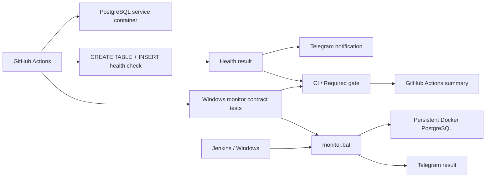

# Hybrid QA Monitoring System

[](https://github.com/TokhirjonYuldoshev/qa-docker-monitor/actions/workflows/main.yml)

Automated PostgreSQL health checks with **GitHub Actions**, **Docker**, **Jenkins-compatible Windows monitoring** and **Telegram alerts**.

## What this project demonstrates

- scheduled database health checks in GitHub Actions;
- pre-merge validation of monitoring changes on pull requests;
- PostgreSQL service container with readiness health check;
- SQL write validation instead of a superficial port-only check;
- explicit separation between the **health signal** and the **notification channel**;
- contract tests for Windows/Jenkins monitor exit semantics using isolated command doubles;
- a stable aggregate **`CI / Required gate`** for future branch-protection wiring;
- local Windows monitoring script intended for Jenkins execution;
- credentials passed through CI/Jenkins secret storage rather than committed to the repository.

## Architecture



## Cloud workflow

Workflow: `.github/workflows/main.yml`

Triggers:

- pull requests — validates both the PostgreSQL probe and Windows monitor contract before merge, with Telegram notifications intentionally skipped;
- push to `main` — runs both validation paths and may send Telegram status;
- manual `workflow_dispatch` — runs both validation paths on demand;
- schedule at **09:00 and 21:00 UTC** every day — runs the operational PostgreSQL health probe without spending a Windows runner on a static contract test.

The Linux job starts a PostgreSQL service container, waits for its readiness health check, installs the PostgreSQL client and performs a real SQL write operation:

```sql
CREATE TABLE IF NOT EXISTS robot_log (...);
INSERT INTO robot_log (status) VALUES ('GitHub Cloud Test - OK');
```

A separate `windows-latest` job executes `monitor.bat` against isolated `docker.cmd` and `curl.cmd` command doubles on pull requests, pushes and manual runs. It verifies three failure-semantics contracts:

| Scenario | Expected result |
| --- | --- |
| Database succeeds, Telegram disabled | exit `0` |
| Database succeeds, Telegram transport fails | exit `0` |
| Database fails, Telegram transport also fails | exit `1` |

These tests validate orchestration semantics without requiring a real Jenkins agent, a persistent local database, or real Telegram credentials.

The final **`CI / Required gate`** aggregates the required outcomes. For PR/push/manual validation it requires both PostgreSQL and Windows contract jobs to succeed. For scheduled operational checks it requires PostgreSQL health while the Windows contract job is intentionally skipped.

## Failure semantics

The **database write check is the source of truth** for the monitoring result.

- readiness/setup/SQL failure produces a failed workflow;
- the result is written to the GitHub Actions job summary;
- Telegram success/failure delivery is attempted as an auxiliary observability channel on operational runs;
- pull-request validation never sends Telegram notifications;
- missing Telegram secrets are reported as an explicit notice rather than an opaque transport error;
- a Telegram transport problem does not convert a healthy PostgreSQL check into a false database failure;
- notification steps do not hide a real database failure;
- the Windows contract suite guards those same exit-code semantics against regression;
- the aggregate gate cannot report success when a required validation job fails.

This separation keeps monitoring semantics clear: **product/dependency health** and **alert delivery health** are related, but they are not the same signal.

## Local / Jenkins-compatible monitor

`monitor.bat` checks a persistent Docker PostgreSQL container by executing an `INSERT` through `psql`. The script returns a non-zero exit code when the database check fails and returns zero after a successful write check. Telegram delivery and retention cleanup are best-effort operations and cannot overwrite that database-health result.

Runtime configuration:

| Variable | Required | Behavior |
| --- | --- | --- |
| `DB_CONTAINER` | No | Defaults to `dev-postgres-db` |
| `BUILD_NUMBER` | No | Defaults to `manual` outside Jenkins |
| `TOKEN` | No for DB health | Enables Telegram only when paired with `CHAT_ID` |
| `CHAT_ID` | No for DB health | Enables Telegram only when paired with `TOKEN` |

Missing Telegram configuration does **not** prevent the database check from running. This keeps monitoring useful in local/Jenkins environments where alert delivery is intentionally disabled or not yet configured.

No bot token or chat ID is stored in the repository.

## Tech stack

| Area | Technology |
| --- | --- |
| CI / scheduling | GitHub Actions |
| Local automation | Jenkins / Windows batch |
| Database | PostgreSQL |
| Containerization | Docker |
| Contract validation | Windows runner + command doubles |
| Health validation | SQL write health check |
| Merge-ready signal | `CI / Required gate` |
| Notifications | Telegram Bot API |

## Repository structure

```text
qa-docker-monitor/
├── .github/
│   └── workflows/
│       └── main.yml
├── monitor.bat
└── README.md
```

## Why this is a QA project

The goal is not only to keep a process alive. The monitor verifies an observable product dependency — database availability **and write capability** — and produces a repeatable CI signal with pre-merge validation, explicit failure semantics, contract-tested orchestration and auxiliary alerting.

---

**Portfolio project by Tokhirjon Yuldoshev**
