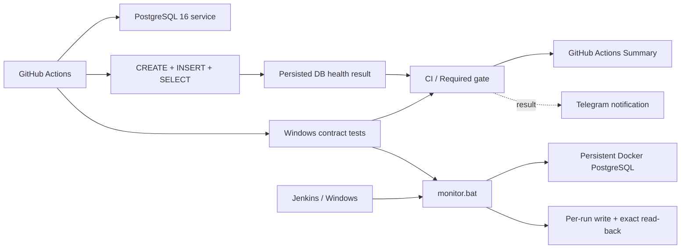

# Гибридный QA-мониторинг PostgreSQL

[](https://github.com/TokhirjonYuldoshev/qa-docker-monitor/actions/workflows/main.yml)

Portfolio-проект по инженерному мониторингу качества: PostgreSQL проверяется через **реальную запись с последующим read-back**, orchestration валидируется в **GitHub Actions**, Windows/Jenkins-логика защищена contract-тестами, а operational results отправляются в **Telegram**.

## Что демонстрирует проект

- scheduled PostgreSQL health checks в GitHub Actions;
- pre-merge validation изменений monitoring logic через Pull Request;
- PostgreSQL 16 service container с readiness health check;
- реальный SQL `CREATE / INSERT / SELECT` вместо поверхностной проверки порта;
- persisted-state validation как для cloud workflow, так и для локального Windows/Jenkins monitor;
- per-run markers, исключающие зависимость read-back от чужой конкурентной записи;
- разделение **database health signal** и **notification transport**;
- contract-тесты Windows/Jenkins monitor через изолированные command doubles;
- стабильный агрегирующий `CI / Required gate`;
- структурированный GitHub Actions Summary;
- Telegram observability с прямой ссылкой на run;
- manual-only Telegram diagnostics: `getMe` → `getChat` → `sendMessage`;
- controlled Dependabot maintenance;
- security/QA governance через `SECURITY.md`, `CONTRIBUTING.md`, `CODEOWNERS` и PR template;
- operational incident response через [`docs/incident-runbook.md`](docs/incident-runbook.md) и structured monitoring-incident issue form.

## Архитектура



## Основной workflow

Файл: `.github/workflows/main.yml`.

Триггеры:

- Pull Request — проверяет SQL health и Windows contract до merge, Telegram намеренно не используется;
- push в `main` — выполняет обе validation paths и отправляет итог в Telegram;
- ручной `workflow_dispatch` — полный on-demand запуск;
- schedule в **09:00 и 21:00 UTC** — operational PostgreSQL health check без лишнего расхода Windows runner.

Linux job поднимает PostgreSQL 16, ждёт readiness и выполняет write/read-проверку. На каждый workflow run формируется уникальный marker из `GITHUB_RUN_ID` и `GITHUB_RUN_ATTEMPT`:

```sql
CREATE TABLE IF NOT EXISTS robot_log (...);
INSERT INTO robot_log (status) VALUES ('<unique run marker>');
SELECT count(*) FROM robot_log WHERE status = '<unique run marker>';
```

Health считается успешным только если SQL-команды завершились без ошибки и read-back вернул **ровно одну** сохранённую запись. Таким образом, проверяется не только принятие `INSERT`, но и наблюдаемое persisted state.

## Windows/Jenkins contract

`windows-latest` job запускает `monitor.bat` против изолированных doubles для `docker.cmd` и `curl.cmd` и проверяет failure semantics без реальной БД, Jenkins agent или Telegram credentials.

| Сценарий | Ожидаемый exit code |
| --- | ---: |
| DB write/read успешен, Telegram выключен | `0` |
| DB write/read успешен, Telegram transport упал | `0` |
| DB write успешен, но read-back command завершился ошибкой | `1` |
| DB read-back вернул неожидаемое состояние | `1` |
| DB command упала и Telegram тоже упал | `1` |

Контракт защищает четыре ключевых правила:

- успешная SQL-команда без подтверждённого read-back недостаточна для healthy result;
- read-back относится к **маркеру текущего запуска**, а не к глобально последней строке таблицы;
- ошибка Telegram не должна превращать исправную БД в ложный failure;
- ошибка БД не должна теряться из-за notification logic.

## Aggregate gate

`CI / Required gate` собирает результаты независимых jobs:

- `PostgreSQL write/read health check`;
- `Windows monitor contract`.

Для PR/push/manual нужны оба успешных сигнала. Для scheduled run Windows contract намеренно `skipped`, а gate оценивает operational PostgreSQL health.

GitHub Actions Summary показывает общий итог, trigger, branch, commit и прямую ссылку на run.

## Operational incident response

[`docs/incident-runbook.md`](docs/incident-runbook.md) определяет triage по владельцу сигнала:

- PostgreSQL persisted write/read health — основной operational source of truth;
- Windows monitor contract — source of truth для exit-code/orchestration semantics;
- `CI / Required gate` — агрегатор, но не замена upstream evidence;
- Telegram — non-blocking observability transport.

Runbook фиксирует порядок triage, severity model, exit criteria и anti-patterns. Для suspected runner/platform incidents допускается максимум **один targeted diagnostic rerun** после конкретного evidence, что external condition восстановился. Повторные rerun-until-green loops, произвольные sleeps и masking notification logic запрещены.

`.github/ISSUE_TEMPLATE/monitoring_incident.yml` превращает эти правила в operational issue contract: при регистрации incident нужно указать owning signal, severity, revision, observed/expected behavior, evidence, reproducibility и impact и подтвердить, что секреты и masking-workarounds не добавлялись. Blank issues отключены через `.github/ISSUE_TEMPLATE/config.yml`; security-вопросы направляются к `SECURITY.md`.

## Telegram observability

Telegram вынесен в отдельный job после quality gate. Сообщение содержит:

- общий статус `HEALTHY` / `ALERT`;
- PostgreSQL write/read health;
- Windows monitor contract;
- `CI / Required gate`;
- репозиторий, ветку, автора, trigger и commit;
- прямую ссылку на GitHub Actions run.

Поддерживаются repository secrets:

```text
TELEGRAM_BOT_TOKEN
TELEGRAM_CHAT_ID
```

Для обратной совместимости также принимаются:

```text
TG_TOKEN
TG_CHAT_ID
```

Notification transport — **вспомогательный observability signal**. Если Telegram API недоступен, реальный DB health result сохраняется и не подменяется transport failure.

Для отдельной проверки интеграции используется manual-only workflow `.github/workflows/telegram-test.yml`. Он проверяет bot token, target chat и отправку тестового сообщения, чтобы отличать ошибку Telegram-конфигурации от ошибки PostgreSQL.

## Локальный / Jenkins-compatible monitor

`monitor.bat` проверяет не только успешность `INSERT`, но и persisted state. Для каждого запуска формируется `EXPECTED_STATUS`, включающий `BUILD_NUMBER` и отдельный `RUN_TOKEN`; после записи скрипт выбирает из `robot_log` **именно этот marker** и сравнивает его с ожидаемым значением.

Это устраняет гонку, при которой параллельный writer мог вставить новую строку между `INSERT` и read-back и ошибочно сделать чужую запись «последней». Локальный health считается успешным только при точном совпадении marker. Ошибка команды, ошибка чтения или mismatch возвращают exit code `1`.

Runtime configuration:

| Переменная | Обязательна | Поведение |
| --- | --- | --- |
| `DB_CONTAINER` | Нет | по умолчанию `dev-postgres-db` |
| `BUILD_NUMBER` | Нет | вне Jenkins используется `manual` |
| `RUN_TOKEN` | Нет | по умолчанию генерируется отдельный token текущего запуска |
| `TOKEN` | Нет для DB health | вместе с `CHAT_ID` включает Telegram |
| `CHAT_ID` | Нет для DB health | вместе с `TOKEN` включает Telegram |

Telegram delivery и retention cleanup выполняются best-effort и не имеют права переписать database-health exit code.

## Failure semantics

- readiness/setup/SQL failure делает health path красным;
- persisted PostgreSQL write/read result является главным health signal;
- cloud run marker исключает ложноположительный read-back по данным другого запуска;
- локальный monitor использует собственный per-run marker и не зависит от глобально последней строки таблицы;
- Telegram failure не создаёт ложный DB failure;
- notification failure не скрывает реальную ошибку БД;
- PR validation не отправляет operational Telegram alerts;
- aggregate gate не может стать зелёным, если обязательный validation job упал;
- Windows contract защищает эти правила от регрессии;
- incident runbook не допускает rerun-until-green или sleep/retry masking.

## Dependency maintenance

`.github/dependabot.yml` проверяет GitHub Actions раз в неделю по часовому поясу `Europe/Minsk`.

Minor/patch updates группируются, major updates остаются отдельными инженерными изменениями. Любой dependency PR проходит те же PostgreSQL, Windows contract и aggregate gates до merge.

## Стек

| Область | Технология |
| --- | --- |
| CI / schedule | GitHub Actions |
| Local automation | Jenkins / Windows batch |
| Database | PostgreSQL 16 |
| Containerization | Docker |
| Contract validation | Windows runner + command doubles |
| Health validation | SQL write + exact per-run read-back assertion |
| Merge signal | `CI / Required gate` |
| Notifications | Telegram Bot API |
| Dependency maintenance | Dependabot |
| Incident response | Runbook + structured Issue Form |

## Структура репозитория

```text
qa-docker-monitor/
├── .github/
│   ├── CODEOWNERS
│   ├── dependabot.yml
│   ├── ISSUE_TEMPLATE/
│   │   ├── config.yml
│   │   └── monitoring_incident.yml
│   ├── pull_request_template.md
│   └── workflows/
│       ├── main.yml
│       └── telegram-test.yml
├── docs/
│   └── incident-runbook.md
├── .gitattributes
├── .gitignore
├── CONTRIBUTING.md
├── SECURITY.md
├── monitor.bat
└── README.md
```

`CONTRIBUTING.md` фиксирует change policy и validation expectations для monitoring logic, `SECURITY.md` описывает работу с секретами и порядок обработки security findings, а incident runbook, structured issue form и issue intake config задают единый operational triage contract.

## Почему это QA-проект

Задача проекта — не просто проверить, что процесс PostgreSQL запущен. Монитор проверяет наблюдаемую способность критичной зависимости **принять конкретную запись и вернуть состояние именно этого запуска обратно**, формирует детерминированный CI signal, валидирует orchestration contract до merge, отделяет dependency health от alert-delivery health и формализует incident response.

Такой подход ближе к инженерии качества production-систем, чем обычный `ping` или port check.

---

**Portfolio project by Tokhirjon Yuldoshev**
