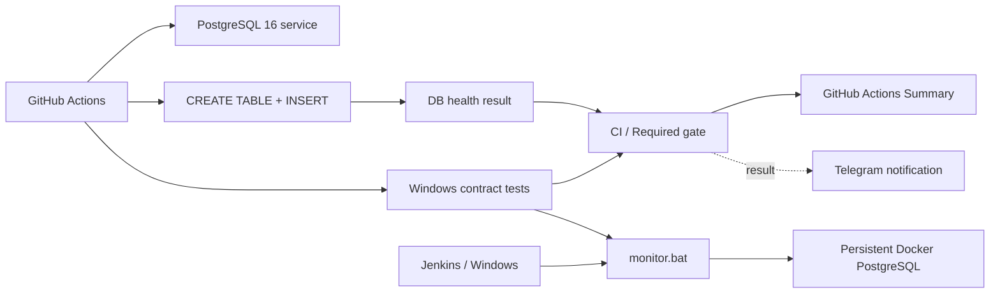

# Гибридный QA-мониторинг PostgreSQL

[](https://github.com/TokhirjonYuldoshev/qa-docker-monitor/actions/workflows/main.yml)

Portfolio-проект по инженерному мониторингу качества: PostgreSQL проверяется через **реальную запись данных**, оркестрация валидируется в **GitHub Actions**, Windows/Jenkins-логика защищена contract-тестами, а результаты operational runs отправляются в **Telegram**.

## Что демонстрирует проект

- scheduled health checks PostgreSQL в GitHub Actions;
- pre-merge проверку изменений monitoring logic через Pull Request;
- PostgreSQL service container с readiness health check;
- реальный SQL `CREATE/INSERT` вместо поверхностной проверки порта;
- явное разделение **health signal** и **notification transport**;
- contract-тесты Windows/Jenkins monitor через изолированные command doubles;
- стабильный агрегирующий `CI / Required gate`;
- Telegram observability с красивым структурированным сообщением и прямой ссылкой на run;
- manual-only Telegram diagnostics: `getMe` → `getChat` → `sendMessage`;
- Dependabot для контролируемого обновления GitHub Actions;
- security/QA governance через `SECURITY.md` и PR template.

## Архитектура



## Основной workflow

Файл: `.github/workflows/main.yml`.

Триггеры:

- Pull Request — проверяет SQL health и Windows contract до merge, Telegram намеренно не используется;
- push в `main` — выполняет обе validation paths и отправляет итог в Telegram;
- ручной `workflow_dispatch` — полный on-demand запуск;
- schedule в **09:00 и 21:00 UTC** — operational PostgreSQL health check без лишнего расхода Windows runner.

Linux job поднимает PostgreSQL 16, ждёт readiness и выполняет реальную write-проверку:

```sql
CREATE TABLE IF NOT EXISTS robot_log (...);
INSERT INTO robot_log (status) VALUES ('GitHub Cloud Test - OK');
```

Именно успешный SQL write является **source of truth** для health result.

## Windows/Jenkins contract

`windows-latest` job запускает `monitor.bat` против изолированных doubles для `docker.cmd` и `curl.cmd` и проверяет failure semantics без реальной БД, Jenkins agent или Telegram credentials.

| Сценарий | Ожидаемый exit code |
| --- | ---: |
| DB успешна, Telegram выключен | `0` |
| DB успешна, Telegram transport упал | `0` |
| DB упала и Telegram тоже упал | `1` |

Это защищает главный контракт: **ошибка уведомления не должна превращать исправную БД в ложный failure, а ошибка БД не должна теряться из-за notification logic**.

## Aggregate gate

`CI / Required gate` собирает результаты независимых jobs:

- `PostgreSQL write health check`;
- `Windows monitor contract`.

Для PR/push/manual нужны оба успешных сигнала. Для scheduled run Windows contract намеренно `skipped`, а gate оценивает operational PostgreSQL health.

GitHub Actions Summary публикуется на русском и показывает итог, trigger, branch, commit и прямую ссылку на run.

## Telegram observability

Telegram вынесен в отдельный job после quality gate. Сообщение содержит:

- общий статус `HEALTHY` / `ALERT`;
- PostgreSQL write health;
- Windows monitor contract;
- `CI / Required gate`;
- репозиторий, ветку, автора, trigger и commit;
- прямую ссылку на GitHub Actions run.

Поддерживаются стандартные repository secrets:

```text
TELEGRAM_BOT_TOKEN
TELEGRAM_CHAT_ID
```

Для обратной совместимости также принимаются существующие:

```text
TG_TOKEN
TG_CHAT_ID
```

Notification transport — **вспомогательный observability signal**. Если Telegram API недоступен, реальный DB health result сохраняется и не подменяется transport failure.

Для отдельной проверки интеграции используется manual-only workflow `.github/workflows/telegram-test.yml`. Он намеренно blocking: проверяет bot token, target chat и отправку тестового сообщения, чтобы отличать ошибку Telegram-конфигурации от ошибки PostgreSQL.

## Локальный / Jenkins-compatible monitor

`monitor.bat` выполняет `INSERT` в PostgreSQL внутри Docker container и возвращает ненулевой exit code при реальном DB failure.

Runtime configuration:

| Переменная | Обязательна | Поведение |
| --- | --- | --- |
| `DB_CONTAINER` | Нет | по умолчанию `dev-postgres-db` |
| `BUILD_NUMBER` | Нет | вне Jenkins используется `manual` |
| `TOKEN` | Нет для DB health | вместе с `CHAT_ID` включает Telegram |
| `CHAT_ID` | Нет для DB health | вместе с `TOKEN` включает Telegram |

Telegram delivery и retention cleanup выполняются best-effort и не имеют права переписать database-health exit code.

## Failure semantics

- readiness/setup/SQL failure делает health path красным;
- PostgreSQL write result является главным сигналом;
- Telegram failure не создаёт ложный DB failure;
- notification failure не скрывает реальную ошибку БД;
- PR validation не отправляет operational Telegram alerts;
- aggregate gate не может стать зелёным, если обязательный validation job упал;
- Windows contract защищает эти правила от регрессии.

## Dependency maintenance

`.github/dependabot.yml` проверяет GitHub Actions раз в неделю по часовому поясу `Europe/Minsk`.

Minor/patch updates группируются, major updates остаются отдельными инженерными изменениями. Любой dependency PR проходит те же PostgreSQL, Windows contract и aggregate gates до merge.

## Стек

| Область | Технология |
| --- | --- |
| CI / schedule | GitHub Actions |
| Local automation | Jenkins / Windows batch |
| Database | PostgreSQL 16 |
| Containerization | Docker |
| Contract validation | Windows runner + command doubles |
| Health validation | SQL write health check |
| Merge signal | `CI / Required gate` |
| Notifications | Telegram Bot API |
| Dependency maintenance | Dependabot |

## Структура репозитория

```text
qa-docker-monitor/
├── .github/
│   ├── dependabot.yml
│   ├── pull_request_template.md
│   └── workflows/
│       ├── main.yml
│       └── telegram-test.yml
├── SECURITY.md
├── monitor.bat
└── README.md
```

## Почему это QA-проект

Задача проекта — не просто проверить, что процесс PostgreSQL запущен. Монитор проверяет наблюдаемую способность критичной зависимости **принимать запись**, формирует детерминированный CI signal, валидирует orchestration contract до merge и отделяет product/dependency health от alert delivery health.

Такой подход ближе к инженерии качества production-систем, чем обычный `ping` или port check.

---

**Portfolio project by Tokhirjon Yuldoshev**
